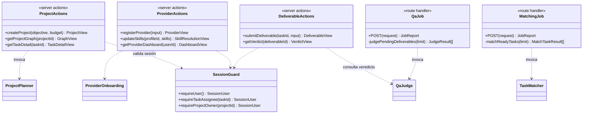
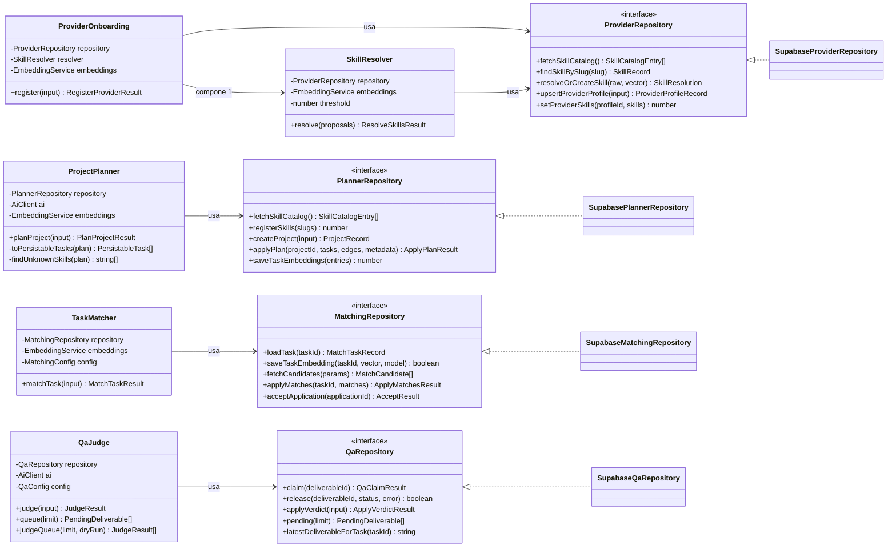
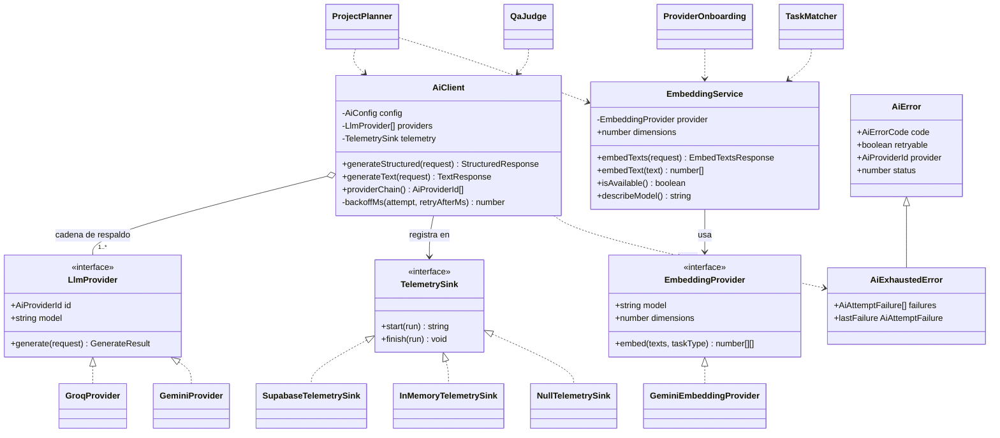
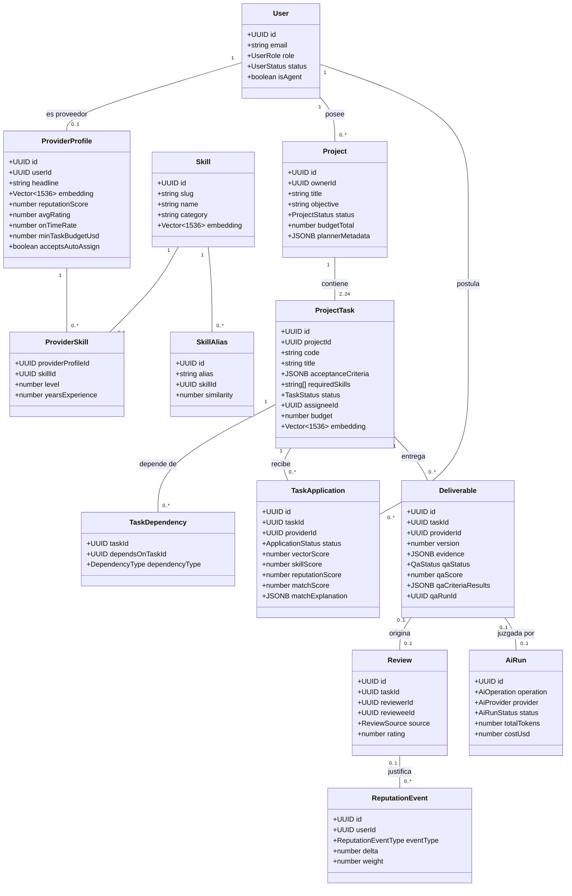

# Diagrama de clases

Los nombres, métodos y relaciones se corresponden con el código del repositorio.

El sistema se organiza en cuatro capas. Cada diagrama de este documento cubre una:

| Capa | Responsabilidad | Diagrama |
|---|---|---|
| Aplicación | Puntos de entrada: interfaz web, acciones de servidor y trabajos programados | §1 |
| Orquestación | Los cuatro agentes del dominio y sus repositorios | §2 |
| Abstracción de IA | Proveedores de modelos, vectorización, telemetría | §3 |
| Dominio persistido | Entidades y sus cardinalidades | §4 |

## 1. Capa de aplicación

Los agentes autónomos se invocan desde el servidor, nunca desde el navegador: es lo que
mantiene la clave con privilegios plenos fuera del cliente. La interfaz llama a acciones de
servidor; los trabajos programados llaman a los mismos casos de uso sin que nadie inicie
sesión, y son los que hacen que el sistema avance solo.

Las acciones de servidor y los trabajos programados son dos puertas al **mismo** núcleo. Esa
simetría es deliberada: nada de lo que hace el sistema depende de que una persona pulse algo,
y lo que una persona pulsa no toma un atajo distinto del que toma el sistema por su cuenta.

## 2. Núcleo de orquestación

### Patrón que organiza esta capa

Cada dominio (planificador, proveedores, emparejamiento, evaluación) repite la misma
estructura de tres piezas:

- un **orquestador** con la lógica del caso de uso,
- una **interfaz de repositorio** que declara qué datos necesita,
- una **implementación Supabase** de esa interfaz.

El orquestador depende de la interfaz, nunca de la implementación. Eso es lo que permite
probar la lógica de decisión con dobles, sin red ni base de datos, que es donde el sistema
puede equivocarse en silencio.

## 3. Capa de abstracción de IA

`AiClient` agrega **una o más** implementaciones de `LlmProvider` en orden de preferencia: si
la primera falla con un error reintentable se reintenta con espera exponencial, y si falla con
un error no reintentable se cede el turno a la siguiente sin gastar intentos. Con una sola
clave configurada el sistema funciona en modo degradado.

## 4. Modelo de dominio persistido

Entidades de `db/schema.sql` con sus cardinalidades reales.

### Notas de cardinalidad

- **`Project` 1 — 2..24 `ProjectTask`**: el rango no es decorativo. Lo impone el esquema Zod
  del planificador (`MIN_TASKS` = 2, `MAX_TASKS` = 24).
- **`ProjectTask` 1 — 0..* `Deliverable`**: una tarea puede acumular varias versiones del
  entregable y `version` se asigna sola por trigger, pero **todo entregable pertenece a
  exactamente una tarea** (`deliverables.task_id` es `not null`).
- **`Deliverable` 0..1 — 0..1 `Review`**: un índice único parcial garantiza **una sola reseña
  automática por (tarea, evaluado, fuente)**. Un segundo entregable de la misma tarea
  actualiza esa reseña en lugar de crear otra.
- **`Review` 0..1 — 0..* `ReputationEvent`**: la tabla de reputación es *append-only* (un
  trigger rechaza UPDATE y DELETE). Cualquier puntuación mostrada debe poder reconstruirse
  sumando `delta × weight`.
- **`Deliverable` 0..1 — 0..1 `AiRun`**: `qa_run_id` es opcional, porque un entregable puede
  resolverse sin consultar al modelo (por ejemplo, una entrega vacía). Y la mayoría de las
  corridas de IA —planificación, vectorización— no proceden de ningún entregable.
- **`TaskDependency`** es la tabla de asociación que forma el DAG. Un trigger
  (`prevent_dag_cycles`) impide insertar una arista que cierre un ciclo, incluso si el código
  de aplicación fallara.

---

**Uso de IA y autoría.** Este documento se elaboró con asistencia de Claude (Anthropic,
modelo `claude-opus-5`). Las decisiones de diseño, la revisión y la verificación son de los
autores, que asumen la responsabilidad sobre su contenido. Constancia formal en
[`11-declaracion-de-uso-de-ia.md`](11-declaracion-de-uso-de-ia.md).
