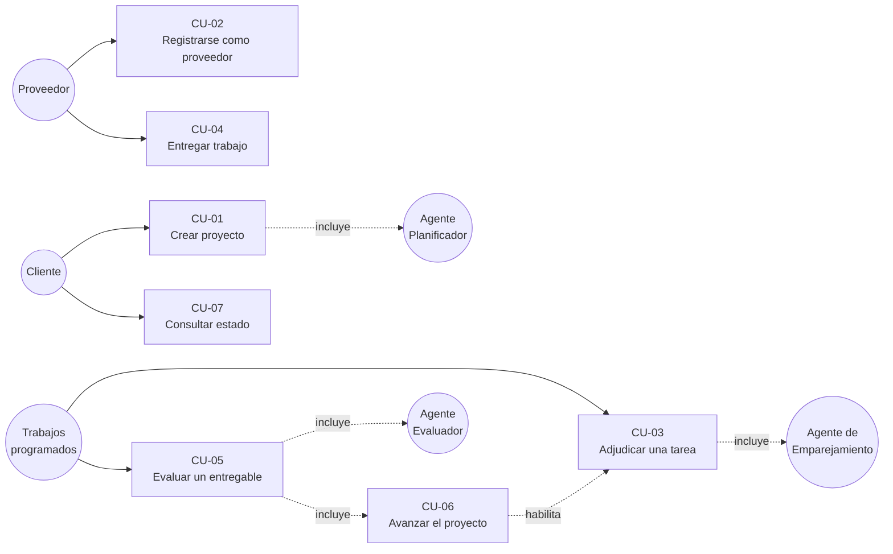

# Casos de uso

## Actores

La particularidad de este sistema es que **tres de los cinco actores no son personas**. Los
agentes autónomos son actores de pleno derecho: inician casos de uso, toman decisiones y
dejan constancia. Modelarlos como simples funciones internas ocultaría lo esencial del
diseño.

| Actor | Tipo | Responsabilidad |
|---|---|---|
| **Cliente** | Humano | Plantea un objetivo y un presupuesto; recibe el resultado |
| **Proveedor** | Humano | Declara habilidades; ejecuta tareas y entrega evidencia |
| **Agente Planificador** | Sistema | Convierte el objetivo en un grafo de tareas |
| **Agente de Emparejamiento** | Sistema | Selecciona y adjudica el proveedor de cada tarea |
| **Agente Evaluador (Juez)** | Sistema | Dictamina si un entregable cumple los criterios |
| **Proveedores de IA** | Externo | Groq y Google AI Studio: generación y vectorización |
| **Supabase** | Externo | Persistencia, autenticación y políticas de acceso |

La flecha punteada de CU-06 a CU-03 es el ciclo que cierra el sistema: aprobar una tarea
desbloquea las siguientes, que quedan disponibles para una nueva adjudicación. Sin
intervención humana en ningún punto del recorrido.

---

## CU-01 · Crear proyecto a partir de un objetivo

**Actor principal:** Cliente · **Actores secundarios:** Agente Planificador, Proveedores de IA

**Precondición**
- Existe un usuario activo en `public.users` que será el propietario.
- El catálogo de habilidades tiene al menos una entrada activa.
- Hay al menos una clave de proveedor de IA configurada.

**Flujo principal**
1. El Cliente, con la sesión iniciada, abre el formulario de creación de proyecto e indica un
   objetivo en lenguaje natural y un presupuesto total.
2. El sistema valida la sesión y que el propietario esté activo.
3. El sistema crea el proyecto en estado `planning`.
4. El Agente Planificador recupera el catálogo de habilidades y solicita al modelo una
   descomposición en tareas.
5. El sistema valida la respuesta contra el contrato: códigos únicos, referencias existentes,
   grafo acíclico, al menos una raíz, presupuestos que suman 1, y criterios de aceptación sin
   dependencia humana.
6. El sistema reparte el presupuesto por resto mayor y calcula el orden topológico.
7. El sistema persiste tareas y dependencias en una única transacción.
8. El sistema marca como `ready` las tareas sin dependencias y como `blocked` el resto.
9. El sistema vectoriza cada tarea para el emparejamiento posterior.
10. El sistema muestra el grafo resultante en el visualizador interactivo.

**Postcondición**
- Existe un proyecto con su grafo acíclico persistido y visible para su propietario.
- La suma de los presupuestos de las tareas iguala exactamente el total del proyecto.
- Al menos una tarea está en estado `ready`.

**Flujos alternativos**
- *5a. La validación falla:* el sistema devuelve los errores al modelo como instrucción de
  corrección y reintenta. Si el modelo no lo resuelve, repara el grafo de forma determinista
  y deja constancia en `planner_metadata.corrections`.
- *7a. La base rechaza el plan por ciclo:* el sistema rompe los ciclos y reintenta una vez.
- *9a. La vectorización falla:* el plan queda guardado igualmente y el emparejamiento operará
  en modo degradado.

---

## CU-02 · Registrarse como proveedor

**Actor principal:** Proveedor · **Actores secundarios:** Proveedores de IA

**Precondición**
- El Proveedor tiene una cuenta y la sesión iniciada.
- El catálogo de habilidades está vectorizado.

**Flujo principal**
1. El Proveedor completa el formulario de alta: titular del perfil, habilidades con nivel y
   años, tarifa, disponibilidad, presupuesto mínimo por tarea y si acepta adjudicación
   automática.
2. El sistema normaliza cada habilidad en cascada: coincidencia exacta de identificador,
   alias conocido, similitud semántica por encima del umbral, o creación de una nueva.
3. El sistema muestra a qué habilidad del catálogo se resolvió cada término escrito, y
   registra las resueltas por similitud para que la próxima coincidencia sea exacta y no
   consuma cuota.
4. El sistema crea la cuenta y el perfil de proveedor.
5. El sistema vectoriza el perfil y lo almacena.

**Postcondición**
- Existe un perfil de proveedor activo con sus habilidades asociadas.
- El catálogo puede haber crecido con conceptos nuevos.

**Flujos alternativos**
- *2a. Dos habilidades declaradas se normalizan al mismo identificador:* se conserva una sola,
  con el nivel y los años más altos de las dos.
- *5a. La vectorización falla:* el perfil queda activo y será recuperable por el ramal del
  emparejamiento que no requiere vector.

---

## CU-03 · Adjudicar una tarea

**Actor principal:** Agente de Emparejamiento (disparado por un trabajo programado, sin que
nadie lo solicite)

**Precondición**
- La tarea existe, está disponible y no tiene proveedor asignado.
- Existe al menos un perfil de proveedor activo.

**Flujo principal**
0. El trabajo programado recupera las tareas disponibles y procesa cada una.
1. El agente carga la tarea y, si no tiene vector, lo calcula.
2. El agente recupera candidatos combinando búsqueda por vecinos aproximados con los filtros
   de elegibilidad, sobre-recuperando antes de filtrar.
3. El agente puntúa a cada candidato: afinidad semántica reescalada, cobertura de habilidades
   ponderada por nivel, y reputación con saturación y valor neutro para quien no tiene
   historial.
4. El agente ordena con desempate determinista y recorta al tamaño de la lista corta.
5. El agente escribe las candidaturas con su explicación completa.
6. Si el mejor candidato supera el umbral de adjudicación, el agente le asigna la tarea,
   acepta su candidatura y rechaza las demás en la misma transacción.

**Postcondición**
- La tarea queda asignada a un proveedor, o con sus candidaturas registradas a la espera de un
  candidato mejor en un ciclo posterior.
- Cada candidatura conserva la explicación con la que se la puntuó, consultable desde la
  interfaz.
- El visualizador del grafo refleja el cambio en vivo.

**Flujos alternativos**
- *2a. Ningún candidato supera los filtros:* el sistema informa qué filtro excluyó a cada
  proveedor y no escribe nada.
- *2b. Ningún proveedor tiene vector:* el ranking usa solo habilidades y reputación, con los
  pesos redistribuidos.
- *6a. Otra adjudicación se completó primero:* la transacción falla por violación de unicidad
  y el sistema lo informa sin sobrescribir.

---

## CU-04 · Entregar trabajo

**Actor principal:** Proveedor

**Precondición**
- La tarea tiene proveedor asignado.

**Flujo principal**
1. El Proveedor abre el espacio de entrega de la tarea, donde los criterios de aceptación
   están a la vista.
2. El Proveedor completa el entregable: resumen, contenido, artefactos y evidencia asociada a
   cada criterio.
3. El sistema asigna el número de versión automáticamente.
4. El sistema advierte si algún criterio queda sin evidencia declarada.
5. El sistema marca la tarea como entregada y la encola para evaluación.

**Postcondición**
- Existe un entregable en cola de evaluación.
- El visualizador del grafo refleja el nuevo estado de la tarea.

**Flujos alternativos**
- *4a. Faltan claves de evidencia:* se avisa y se continúa. Bloquear la entrega sería peor que
  aceptarla desalineada: el juez la evaluará contra el contenido general, con menos confianza.

---

## CU-05 · Evaluar un entregable

**Actor principal:** Agente Evaluador (disparado por un trabajo programado) · **Actores
secundarios:** Proveedores de IA

**Precondición**
- Existe un entregable en cola de evaluación.

**Flujo principal**
0. El trabajo programado recupera la cola de entregables, del más antiguo al más reciente.
1. El agente toma el turno de forma exclusiva, de modo que ningún otro pueda juzgarlo a la vez.
2. El agente recupera tarea, criterios de aceptación, proyecto y evidencia.
3. El agente solicita al modelo un veredicto **por cada criterio**, con la evidencia citada y
   un grado de confianza. No se le informa quién entregó.
4. El sistema valida que haya exactamente un veredicto por criterio existente.
5. El sistema degrada a «no verificable» todo veredicto favorable cuya confianza sea
   insuficiente.
6. El sistema calcula puntuación, estado y movimientos de reputación con una política
   determinista.
7. El sistema escribe veredicto, reseña automática, eventos de reputación y nuevo estado de la
   tarea en una única transacción.
8. El sistema notifica al Proveedor con el resumen accionable y el desglose por criterio.

**Postcondición**
- El entregable queda en `approved`, `rejected` o `revision_requested`.
- Si fue aprobado, existe la reseña y los eventos de reputación correspondientes.
- La tarea refleja el veredicto y el Proveedor puede consultar el desglose por criterio.

**Flujos alternativos**
- *1a. Otro evaluador tiene el turno:* se informa y no se evalúa.
- *1b. El entregable ya fue aprobado o rechazado:* el veredicto es terminal y no se revisa.
- *2a. El entregable no aporta evidencia alguna:* se pide revisión sin consultar al modelo.
- *3a. Los proveedores de IA fallan:* el entregable vuelve a `error`, que permite reintentar.
  **Nunca se rechaza por un fallo de infraestructura.**
- *4a. Falta el veredicto de algún criterio:* se devuelve al modelo con el mensaje exacto para
  que lo complete.
- *6a. Se agotó el máximo de intentos de revisión:* la revisión se convierte en rechazo y la
  tarea se cierra.

---

## CU-06 · Avanzar el proyecto

**Actor principal:** Sistema (disparado por CU-05)

**Precondición**
- Una tarea acaba de pasar a estado `approved`.

**Flujo principal**
1. El disparador de base de datos recalcula la disponibilidad de las tareas del proyecto.
2. Toda tarea bloqueada cuyas dependencias estén aprobadas pasa a disponible.
3. El visualizador del grafo refleja el cambio en vivo, sin recargar.
4. Si todas las tareas del proyecto están aprobadas, el proyecto pasa a completado.

**Postcondición**
- Las tareas desbloqueadas quedan disponibles para CU-03, cerrando el ciclo.
- El Cliente ve avanzar su proyecto sin haber intervenido en ningún punto.

**Flujos alternativos**
- *1a. Una tarea aprobada se reabre:* sus dependientes vuelven a `blocked`.

---

## CU-07 · Consultar el estado de un proyecto

**Actor principal:** Cliente

**Precondición**
- El Cliente tiene la sesión iniciada y es propietario del proyecto.

**Flujo principal**
1. El Cliente abre su panel y selecciona un proyecto.
2. El sistema muestra el grafo interactivo con el estado de cada tarea, sus dependencias y el
   proveedor asignado.
3. El Cliente abre una tarea y consulta sus criterios de aceptación, las candidaturas con su
   puntuación desglosada, los entregables y el veredicto del evaluador.
4. El sistema actualiza la vista en vivo a medida que los agentes avanzan.

**Postcondición**
- El Cliente conoce el avance y el fundamento de cada decisión automática, sin haber
  participado en ninguna.

**Flujos alternativos**
- *2a. El proyecto pertenece a otro usuario:* las políticas de acceso lo impiden y el sistema
  responde como si no existiera.

---

**Uso de IA y autoría.** Este documento se elaboró con asistencia de Claude (Anthropic,
modelo `claude-opus-5`). Las decisiones de diseño, la revisión y la verificación son de los
autores, que asumen la responsabilidad sobre su contenido. Constancia formal en
[`11-declaracion-de-uso-de-ia.md`](11-declaracion-de-uso-de-ia.md).
