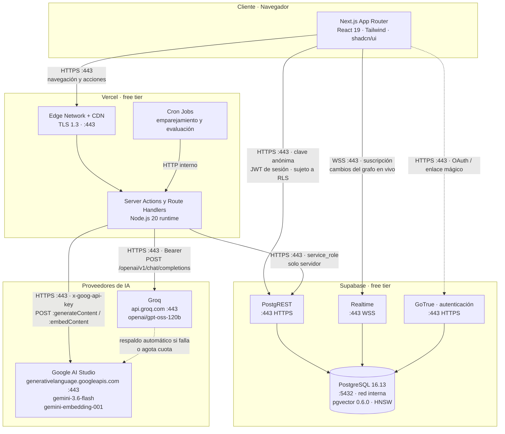
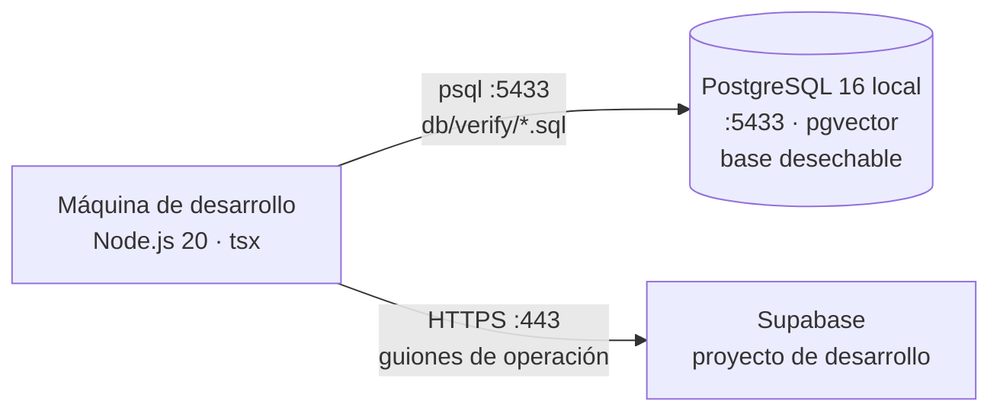

# Diagrama de infraestructura

## Componentes de despliegue

## Protocolos y puertos

| Origen | Destino | Protocolo | Puerto | Autenticación |
|---|---|---|---|---|
| Navegador | Vercel Edge | HTTPS/HTTP2, TLS 1.3 | 443 | Cookie de sesión |
| Navegador | Supabase PostgREST | HTTPS/REST | 443 | Clave anónima + JWT de sesión |
| Navegador | Supabase Realtime | WebSocket seguro | 443 | JWT de sesión |
| Navegador | Supabase GoTrue | HTTPS | 443 | Enlace mágico u OAuth |
| Server Actions | Supabase PostgREST | HTTPS/REST y RPC | 443 | `Bearer <service_role>` |
| Server Actions | Groq API | HTTPS/JSON | 443 | `Authorization: Bearer` |
| Server Actions | Google AI Studio | HTTPS/JSON | 443 | Cabecera `x-goog-api-key` |
| Cron de Vercel | Route Handlers | HTTPS interno | 443 | Secreto compartido de despliegue |
| PostgREST / Realtime / GoTrue | PostgreSQL | TCP, red interna de Supabase | 5432 | Gestionado por la plataforma |
| Verificación local | PostgreSQL desechable | TCP local | 5433 | `trust`, base efímera de pruebas |

**Ninguna conexión directa a PostgreSQL desde la aplicación.** Todo pasa por PostgREST sobre
HTTPS; el puerto 5432 no se expone fuera de la red interna de Supabase. Esa decisión es
también la que obliga a que toda operación atómica esté escrita como función PL/pgSQL: el
cliente HTTP no ofrece transacciones de varias sentencias.

## Separación de privilegios

Es la frontera que permite que el sistema sea autónomo sin ser inseguro.

| Componente | Credencial | Alcance |
|---|---|---|
| Navegador | Clave anónima + JWT de sesión | Sujeto a las 44 políticas de acceso por fila: cada usuario ve solo lo suyo |
| Server Actions | `service_role` | Bypassea las políticas; ejecuta los agentes autónomos |
| Cron de Vercel | Secreto de despliegue, luego `service_role` | Dispara emparejamiento y evaluación sin que nadie inicie sesión |

La clave `service_role` **nunca llega al navegador**: solo se lee en el servidor, y el cliente
administrador lanza una excepción si detecta un entorno de navegador. Los agentes operan con
privilegios plenos desde el servidor, mientras cada persona que entra por la interfaz queda
confinada a lo que las políticas le permiten ver.

Las credenciales viven en variables de entorno de Vercel y en el archivo local de desarrollo,
que está excluido del control de versiones.

## Por qué los trabajos programados son parte de la infraestructura

Sin un disparador periódico, el sistema solo avanzaría cuando alguien ejecutara una acción
—y eso sería intervención humana disfrazada. Los trabajos programados de Vercel son lo que
convierte el ciclo en verdaderamente autónomo: emparejan las tareas que quedaron disponibles
y evalúan los entregables en cola, sin que nadie lo pida.

| Trabajo | Frecuencia | Qué hace |
|---|---|---|
| Emparejamiento | Cada 15 minutos | Adjudica las tareas disponibles al mejor candidato que supere el umbral |
| Evaluación | Cada 10 minutos | Juzga los entregables en cola, del más antiguo al más reciente |

Ambos son idempotentes y toman el turno de forma exclusiva, de modo que dos ejecuciones
solapadas no duplican trabajo ni reputación.

## Entorno de desarrollo y verificación

Las funciones SQL se verifican por comportamiento sobre una base local que se crea y se
destruye en cada corrida, **antes** de aplicarse en Supabase. Esa práctica nació de un
incidente real: dos guiones que parecían correctos a la vista fallaron al ejecutarse.

---

**Uso de IA y autoría.** Este documento se elaboró con asistencia de Claude (Anthropic,
modelo `claude-opus-5`). Las decisiones de diseño, la revisión y la verificación son de los
autores, que asumen la responsabilidad sobre su contenido. Constancia formal en
[`11-declaracion-de-uso-de-ia.md`](11-declaracion-de-uso-de-ia.md).
